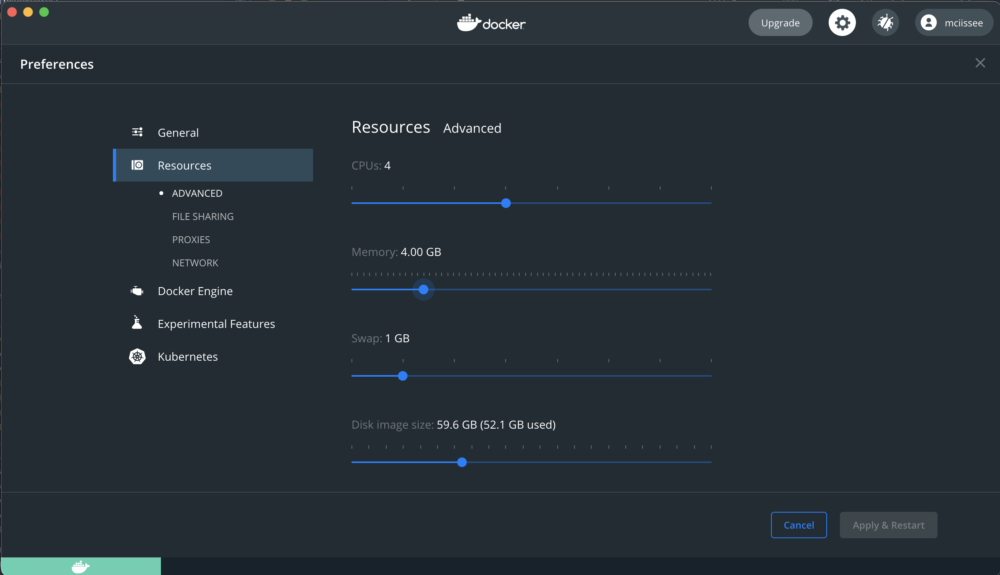
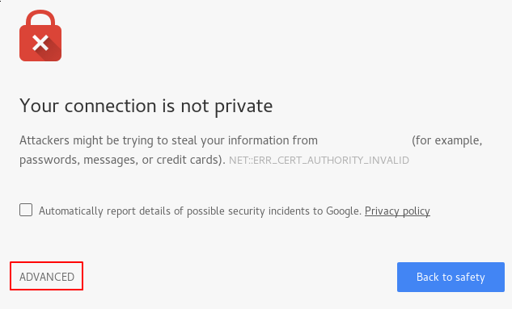
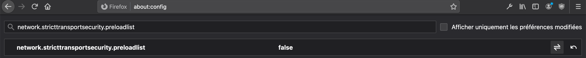
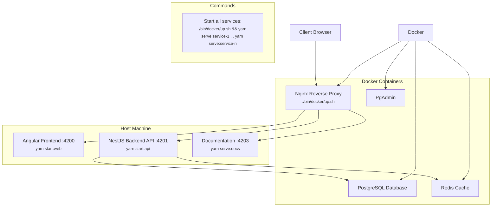
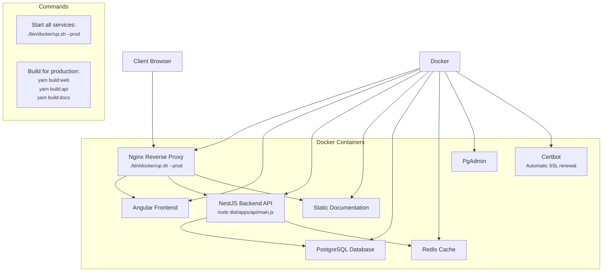
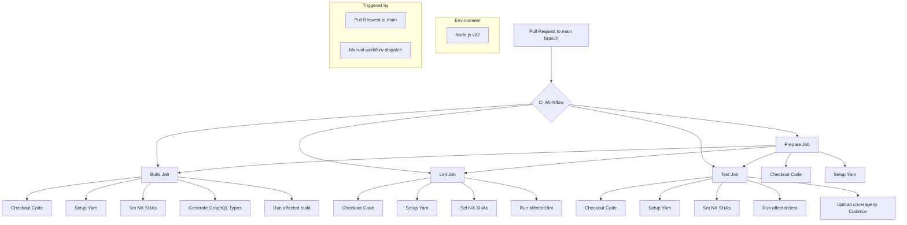

# PLaTon - Platform for Learning and Teaching Online

<p align="center">
  
</p>

<p align="center">
  <a href="https://github.com/cisstech/platon/actions/">
    
  </a>
  <a href="https://codecov.io/gh/cisstech/platon">
    
  </a>
  <a href="https://www.codefactor.io/repository/github/cisstech/platon/overview/main">
    
  </a>
</p>

## Table of Contents

1. [Introduction](#introduction)
2. [Key Features](#key-features)
3. [Installation](#installation)
   1. [Prerequisites](#prerequisites)
   2. [Recommendations](#recommendations)
   3. [Setup](#setup)
4. [Technical Documentation](#technical-documentation)
   1. [Platform Architecture](#platform-architecture)
   2. [Environment Configuration](#environment-configuration)
   3. [Codebase Structure](#codebase-structure)
   4. [Key Libraries and Frameworks](#key-libraries-and-frameworks)
   5. [Development Workflow](#development-workflow)
      1. [Scripts](#scripts)
      2. [Testing](#testing)
      3. [Linting and Formatting](#linting-and-formatting)
   6. [Deployment](#deployment)
      1. [On-premise](#on-premise)
      2. [Cloud](#cloud)
      3. [CI Pipelile](#ci-pipeline)
      4. [Github](#github-home-page)
5. [Functional Documentation](#documentation)
6. [Contributing](#contributing)
7. [License](#license)

## Introduction

PLaTon is an open-source online learning and teaching platform designed to facilitate the creation, management, and sharing of educational resources. It provides a comprehensive set of tools for educators, students, and administrators to create, organize, and manage courses and activities in a collaborative environment. PLaTon aims to support the learning process by integrating with popular Learning Management Systems (LMS) and fostering an active community of users and contributors.

Homepage : <https://cisstech.github.io/platon/>

## Key Features

- Resource Management: Create, edit, and manage resources, such as circles, activities, and exercises, using an intuitive interface.
- Course and Activity Management: Organize courses and activities into different sections or modules, with customizable access permissions and content visibility settings.
- User Types and Roles: Supports different user types, including students, teachers, and administrators, with customizable permissions and access levels.
- Tags and Topics: Efficiently categorize and search resources using a tagging system, making it easy to find relevant content.
- User Groups and Notifications: Create and manage user groups, enabling collaboration and communication between members, with an integrated notification system.
- LMS Integration: Seamlessly integrate with popular LMS systems, such as Moodle, Canvas, and Blackboard, using the LTI protocol.
- Responsive Design: Access the platform from any device, with a responsive design that adapts to different screen sizes and resolutions.
- Open Source: PLaTon is built on open-source technologies and encourages community contributions to improve the platform.

## Planned features

- Multilingual Support: PLaTon will supports multiple languages, making it accessible to a global audience.

## Installation

### Prerequisites

In order to run PLaTon you'll need the following tools installed

- [`Docker`](https://www.docker.com)
- [`Docker Compose`](https://docs.docker.com/compose/)
- [`OpenSSL`](https://www.openssl.org)
- [`ca-certificates`](https://packages.debian.org/fr/sid/ca-certificates) (only on a linux system)
- [`Visual Studio Code`](https://code.visualstudio.com)
- [`Node`](https://nodejs.org/en)
- [`Yarn`](https://classic.yarnpkg.com/lang/en/docs/install/#mac-stable)

```bash
> docker --version
Docker version 20.10.22, build 3a2c30b

> node --version
v22.0.0

> yarn --version
1.22.19

> nvm --version
0.37.2

```

### Recommendations

> We highly suggest the use of [nvm](https://github.com/nvm-sh/nvm) to update node version easily based on the `.npmrc` file placed inside the root folder.

> By default, the docker daemon always runs as the `root` user on a linux system. If you don’t want to preface the docker command with `sudo` [please read this guide](https://www.digitalocean.com/community/questions/how-to-fix-docker-got-permission-denied-while-trying-to-connect-to-the-docker-daemon-socket).

> Also if you are using docker for mac, we recommend you to increase the memory size to at least 4GB in the resources section of the docker dashboard.

<p align="left">
    
</p>

### Setup

- **Clone the repository**: Clone the PLaTon repository from GitHub to your local machine using the following command:

  ```sh
  git clone https://github.com/cisstech/platon.git
  ```

- **Install dependencies**: Navigate to the project's root directory and run the following command to install the required dependencies:

  ```sh
  yarn
  ```

- **Set up the environment**: After cloning and installing the repository, run the `./bin/install.sh` script to set up the necessary environment variables. This script generates an `.env` and `./tools/database/init.json` files with the default values from the `./templates` directory, which you can customize according to your development or production environment. Also a self signed ssl certificate will be generated into `.docker/nginx/ssl/certs` to run the project in `https` during develop. Please note that these generated files are not kept in the Git history.

  ```sh
  ./bin/install.sh
  ```

  Make sure to review the generated files and update the values if necessary. For more information on environment variables, refer to the Environment Configuration section of the documentation.

- **Start the Docker services** With the environment variables set up, start the Docker services (Postgres, Redis, etc.) using Docker Compose.

  ```sh
  ./bin/docker/up.sh
  ```

- This script will build the docker images for backend services and start containers.

- **Initialize the database**: Set up the PostgreSQL database by running the following scripts:

  ```sh

  ./bin/migration/run.sh
  ./bin/init-db.sh
  ```

- **Run the backend server**: Start the backend server by running the following script:

  ```sh
  yarn serve:api
  ```

  This script will start the backend server, which handles all API requests, on <http://localhost:4201>

- **Run the frontend server**: In a separate terminal, navigate to the project's root directory and start the frontend server by running the following script:

  ```sh
  yarn graphql:generate
  yarn serve:web
  ```

  This script will start the frontend server, which serves the user interface, on <http://localhost:4200>. You can specify `--hmr` option to enable angular [Hot Module Replacement feature](https://medium.com/the-crazy-coder/watch-out-when-using-hmr-with-angular-b28a4dc7e19a)

**Verify installation**: To ensure that PLaTon has been successfully installed and set up, check that you can access the platform in your web browser at <https://localhost> and that the backend server is responding to API requests. If everything is working as expected, you should be able to create and manage resources, courses, and activities, as well as register and log in as different user types.

At this point, you may see an error in your browser like the following one:

<p align="left">
  
</p>

The message and the way you will fix it might be different depending on the browser.

- On **Firefox**, you should open the page `about:config` in a new tab and toggle off the `network.stricttransportsecurity.preloadlist` setting then refresh the page, you will now see an option to bypass the warning.
<p align="left">
    
</p>

- On **Chrome**, click a blank section of the denial page.
  Using your keyboard, type `thisisunsafe`. This will add the website to a safe list, where you should not be prompted again.
  Strange steps, but it surely works!

- On **Safari** for mac, you should add `./docker/nginx/ssl/certs/localhost.crt` the Keychain app, then approve the `localhost` certificate by double click on it.

<p align="left">
    
</p>

Note: The default administrator account has the following credentials:

- Username: ypicker
- Password: password

The other default accounts are listed inside the `./tools/database/init.json` file.

See the [environment configuration section](#environment-configuration) for more information about default accounts.

## Technical Documentation

### Platform Architecture

PLaTon is a comprehensive online learning and teaching platform. It is designed with a modular architecture to provide a scalable, maintainable, and flexible solution for managing educational resources, activities, courses, and user interactions.

#### Technical Stack

The platform is built using a modern tech stack, ensuring high performance and robustness. The main components of the technical stack are:

- **Nx**: A powerful workspace manager used to manage and develop multiple applications and libraries within a single monorepo.

- **NestJS**: A popular and versatile server-side framework for building efficient, reliable, and scalable Node.js server-side applications.

- **Angular**: A widely-used front-end framework for building single-page applications with a focus on performance, maintainability, and testability.

- **NextJS/Nextra**: A modern toolings for building efficient documentation pages

- **PostgreSQL**: A robust and reliable open-source relational database management system that provides powerful features, excellent performance, and scalability.
  Redis: An in-memory data structure store, used as a cache for enhanced performance and scalability.

- **Nginx**: A webserver used to reverse proxy all the connected parts of the application.

- **Docker**: A containerization platform used for creating, deploying, and running applications in a consistent and reproducible environment.

The platform is organized into four main components:

- **Client-side (Front-end)**: The client-side application is built using Angular and provides a responsive and user-friendly interface for interacting with the platform. It consumes the GraphQL and REST APIs provided by the server-side application and handles user authentication, resource management, course and activity management, notifications, and LMS integration.

- **Server-side (Back-end)**: The server-side application is built using NestJS and provides a GraphQL API for interacting with the platform's data and services. It manages user authentication, resource management, course and activity management, notifications, and LMS integration. It also handles communication with the PostgreSQL database and Redis cache.

- **Database and Cache**: PostgreSQL is used as the primary database for storing the platform's data, while Redis is used as a cache to improve performance and scalability.
  Modular Design

- **Documentation**: The platform documentation is build using [Nextra](https://nextra.site)

#### Docker stack

- Overall

```sh
┌─────────────────────────────────────────────────────┐
│                      Docker                         │
├─────────────────────────────────────────────────────┤
│                      Nginx                          │
│                                                     │
│                Reverse Proxy Config                 │
│                                                     │
├─────────────────┬─────────────────┬────────────────-┤
│    PostgreSQL   │      Redis      │     PgAdmin     │
│                 │                 │                 │
│     (Database)  │    (Cache)      │  (Admin Panel)  │
└─────────────────┴─────────────────┴────────────────-┘
```

- Development mode



- Production mode



Here's a high-level overview of how the different parts interact:

- Users access the web application through their browsers.
  The browsers send requests to the Nginx reverse proxy.
  Depending on the environment and request type:

- a. In development, Nginx forwards requests to the appropriate Angular or Nest.js application running on the host machine.

- b. In production, Nginx serves the Angular app and forwards API requests to the Nest.js application inside the container.

- The Nest.js application processes the request and interacts with the PostgreSQL database and Redis cache as needed.

- The Nest.js application returns the response to the Nginx reverse proxy, which then forwards it to the user's browser.

This hybrid approach allows for easy development and testing, while still leveraging the benefits of containerization for production deployments.

## Technical Overview

PLaTon is built on a modern, scalable architecture using the following key technologies:

- Nx: A powerful monorepo tool for managing multiple applications and libraries
- NestJS: A progressive Node.js framework for building efficient server-side applications
- Angular: A platform for building web applications
- PostgreSQL: A robust, open-source relational database
- Redis: An in-memory data structure store used for caching
- Docker: For containerization and easy deployment
- Nginx: As a reverse proxy and load balancer

- In development mode, the architecture uses Docker to run the PostgreSQL, Redis, and PgAdmin services. The Nest.js, Angular and NextJS applications are run on the host machine. Nginx is set up as a reverse proxy, directing requests to the appropriate services or applications.

- The Nginx reverse proxy configuration is different for development and production environments. In development, Nginx is configured to proxy requests to the Angular and Nest.js applications running on the host machine. In production, the Angular application is built and placed inside the Nginx container while the Nest.js application run on a different service inside docker, which is then used as a full reverse proxy.

### Environment Configuration

This document describes the environnement configuration for the application, including the required environment variables and their descriptions. Proper configuration is crucial for the smooth operation of the system. Make sure to set these variables before running the application in development or production mode.

| Name                       | Service  | Description                                                                         | Default                          |
| -------------------------- | -------- | ----------------------------------------------------------------------------------- | -------------------------------- |
| COMPOSE_HTTP_TIMEOUT       | docker   | Increase docker build timeout which is set to 20 by default                         | 200                              |
| POSTGRES_USER              | postgres | PostgreSQL database username.                                                       | platon                           |
| POSTGRES_PASSWORD          | postgres | PostgreSQL database password.                                                       | test                             |
| POSTGRES_DB                | postgres | PostgreSQL database name.                                                           | platon                           |
| PG_DATA                    | postgres | PostgreSQL data directory.                                                          | PG_DATA=/var/lib/postgresql/data |
| PGADMIN_DEFAULT_EMAIL      | pgadmin  | PgAdmin default email for login.                                                    | test@test.com                    |
| PGADMIN_DEFAULT_PASSWORD   | pgadmin  | PgAdmin default password for login.                                                 | test                             |
| DB_NAME                    | api      | Database name for the API service.                                                  | platon_db                        |
| DB_USERNAME                | api      | Database username for the API service.                                              | platon                           |
| DB_PASSWORD                | api      | Database password for the API service.                                              | test                             |
| DB_HOST                    | api      | Database host for the API service.                                                  | localhost                        |
| DB_PORT                    | api      | Database port for the API service.                                                  | 5432                             |
| REDIS_HOST                 | api      | Sets NestJs `REDIS_HOST` value setting                                              | localhost                        |
| REDIS_PORT                 | api      | Sets NestJs `REDIS_PORT` value setting                                              | 6379                             |
| SECRET_KEY                 | api      | Secret key for the API service.                                                     | secret                           |
| PASSWORD_SALT              | api      | Secret key for the API service.                                                     | 10                               |
| JWT_ACCESS_TOKEN_LIFETIME  | api      | Access token lifetime for JWT authentication.                                       | 7d                               |
| JWT_REFRESH_TOKEN_LIFETIME | api      | Refresh token lifetime for JWT authentication.                                      | 7d                               |
| FILES_CACHE_LIFETIME       | api      | Duration of cacheable files in seconds.                                             | 604800 (7 days)                  |
| GRAPHQL_PLAYGROUND         | api      | Enable/disable GraphQL Playground.                                                  | true                             |
| SANDBOX_URL                | api      | Defines python sandbox url.                                                         | <http://localhost:7000>          |
| SANDBOX_ENV_LIFESPAN       | api      | Value in seconds that determins for how long node sandbox env files should be kept. | 604800 (7 days)                  |
| SERVER_NAME                | nginx    | Defines nginx server name.                                                          | localhost                        |

### Codebase Structure

The platform's codebase is organized into a series of libraries and applications within the Nx workspace. This modular design allows for efficient code organization, reusability, and separation of concerns. The main categories of libraries are:

- **Core**: Contains the essential functionality for the platform, such as authentication, user management, tag management, and external library configurations.

- **Feature**: Contains modules for specific features, such as resource management, course and activity management, LMS integration, notifications, and more.

- **Shared**: Contains shared code and utility functions that can be used across different libraries and applications.
  Development Workflow

Each library is organised intro 3 sub-libs :

- **browser**: Code used by the web app only.
- **server**: Code used by the api app only.
- **common**: Code used by both web and api apps.

You can visualize the dependancy graph by running `yarn dep-graph` command.

### Key Libraries and Frameworks

This project is built using a variety of key libraries and frameworks that provide the necessary functionality for the application. In this section, we will discuss the most important libraries and frameworks used, as well as their role in the project.

- **[Docker](https://www.docker.com/)**: Docker is a platform for developing, shipping, and running applications in containers. It allows us to package our application and its dependencies into a single unit, making it easier to manage and deploy. In this project, we use Docker to containerize the Postgres, Redis, and other services, ensuring consistent and reproducible environments across different stages of development.

- **[Nginx](https://www.nginx.com/)**: Nginx is a high-performance web server, reverse proxy, and load balancer. In this project, it is used as a reverse proxy to route incoming requests to the appropriate backend services, such as the NestJS API and the Angular frontend. This enables better load distribution and easier management of multiple services.

- **[PostgreSQL](https://www.postgresql.org/)**: PostgreSQL is a powerful, open-source object-relational database system. It is used in this project to store and manage the application's data. Docker is utilized to run PostgreSQL in a containerized environment, ensuring consistency across development and production environments.

- **[Redis](https://redis.io/)**: Redis is an in-memory data structure store that can be used as a database, cache, and message broker. In this project, Redis is used as a cache service to improve the performance of the application by storing frequently accessed data in memory.

- **[NestJS](https://nestjs.com/)**: NestJS is a progressive Node.js framework for building efficient, reliable, and scalable server-side applications. It is used in this project to create the API service, which handles the backend logic and communication with the PostgreSQL database and Redis cache.

- **[NestJS GraphQL](https://docs.nestjs.com/graphql/quick-start)**: NestJS GraphQL is a module for NestJS that integrates the powerful [GraphQL](https://graphql.org/) query language into the framework. It allows the API service to expose a flexible and efficient GraphQL API for the frontend, enabling more precise and optimized data fetching.

- **[Angular](https://angular.io/)**: Angular is a platform for building web applications with a declarative approach to building UI components. In this project, Angular is used to create the frontend application, which communicates with the NestJS API to provide a seamless user experience.
  In the development mode, the NestJS and Angular applications run on the host machine, while the Postgres, Redis, and other services run inside Docker containers. This hybrid approach allows for easier debugging and faster development, while still leveraging the benefits of containerization for the backend services.

- **[Jison](https://gerhobbelt.github.io/jison/docs/)**: Jison is a JavaScript parser generator inspired by Bison and Yacc. In this project, Jison is used to create custom parsers for specific domain languages or complex expressions, enabling advanced features and providing more flexibility in user interactions.

- **[Nextra](https://nextra.site)**: Modern tooling build ontop of NextJS to create static sites

### Development Workflow

#### Scripts

The `bin` folder contains a collection of scripts to perform various tasks related to the platform's development, deployment, and maintenance. These scripts are organized into subfolders based on their purpose, and they are designed to streamline the development process.

- `/bin/docker`: These scripts are used to manage the Docker containers for the platform.

  - `down.sh`: Stops the Docker containers.
  - `up.sh`: Starts the Docker containers. Use --prod to launch the containers with the docker-compose.prod.yml configuration and -d to run the containers in the background.

- `/bin/graphql`: These scripts are used to generate GraphQL types based on the platform's schema.

  - `build.sh`: Generates GraphQL types in the .graphql/types.ts folder from the schema.gql file.

- `/bin/migration`: These scripts are used to manage TypeORM migrations.

  - `generate.sh`: Generates migrations based on changes in entities. Entities can be placed anywhere and must have the `.entity.ts` extension.
    Example usage: `./bin/migration/generate.sh MyMigrationName`

  - `create.sh`: Creates a new empty migration. Example usage: `./bin/migration/create.sh MyEmptyMigrationName`

  - `run.sh`: Runs the migrations.
  - `revert.sh`: Reverts the last migration.

- `/bin/parser`: This script is used to generate the Jison parser.

  - `build.sh`: Generates the Jison parser from the `libs/feature/compiler/src/lib/pl.jison` file.

- `/bin/shell`: These scripts are used to connect to Docker containers from the terminal.

  - `api.sh`: Connects to the API container (available only in prod mode).
  - `nginx.sh`: Connects to the NGINX container.
  - `postgres.sh`: Connects to the Postgres container.
  - `redis.sh`: Connects to the Redis container.

- `auth-token.sh` : Generates JWT token for existing user in the database.

  ```sh
  ./bin/auth-token
  ```

  > This will output JWT token for defaut `ypicker` user.

  ```sh
  ./bin/auth-token username password
  ```

  > This will output JWT token for the given user.

- `restore-db.sh` : Recreates the application database from a `.sql` dump file.

  ```sh
  ./bin/restore-db.sh path/to/platon.sql
  ```

#### Testing

The test script in the `package.json` file allows developers to run tests for the Platon project. Tests help ensure that the code is working correctly and is of high quality. The tests are a part of the Continuous integration pipeline thanks to Github Actions and are runned before any merge to the master branch.

`yarn test`

The test script leverages Nx to run tests across all the affected applications and libraries within the workspace. It also generates code coverage reports and uses ChromeHeadless browser for testing.

#### Linting and Formatting

Linting helps in maintaining a consistent code style and detecting potential issues in the codebase. In this project, the linting process is set up using ESLint, Nx, and Angular ESLint.

To run the linting process, you can use the following commands:

- For checking without applying linting: `yarn lint`
- For formatting the entire workspace: `yarn lint:fix`

In addition to linting, formatting your code is also essential for maintaining a clean and consistent codebase. Prettier is a popular code formatting tool that can be integrated into your project's development workflow.

Prettier automatically enforces a consistent code style by parsing your code and reformatting it according to predefined rules. It helps eliminate debates about code formatting and ensures that all developers working on the project follow the same formatting guidelines.

To run the formatting process, you can use the following commands:

- For checking the code without applying formating: `yarn format:check`
- For formatting the entire workspace: `yarn format:write`

These scripts will analyze the codebase and provide a report of any linting issues found, helping you maintain a clean and consistent code style across the project.

### Deployment

#### On-premise

- **Clone the repository**: Clone the PLaTon repository from GitHub to your machine using the following command:

  ```sh
  git clone https://github.com/cisstech/platon.git
  ```

- **Set up the environment**: After cloning and installing the repository, run the `./bin/install.sh` script to set up the necessary environment variables. This script generates an `.env` and `./tools/database/init.json` files with the default values from the `./templates` directory, which you can customize.

  ```sh
  ./bin/install.sh
  ```

  Make sure update the values. For more information on environment variables, refer to the Environment Configuration section of the documentation.

- **Setup domain and SSL**: This project is configured to generate auto updated ssl certificates with let's encrypt and cerbot. If you plan to use this setup to generate ssl config for your domain, please follow theses steps first, otherwises you can ignore them.

  - Update the `./bin/init-letsencrypt.sh` by replacing the `example.com` by your domain inside `domains=(example.com www.example.com)`.
  - Update the `.docker/nginx/nginx.prod.conf` by uncommenting all regions starting with `### BEGIN CERTBOT ONLY ###` and commenting all regions stating with `### BEGIN NON CERTBOT ONLY ###`.
  - Update the `volumes` section of the nginx service inside the `docker-compose.prod.yml` to uncomment the `# LET'S ENCRYPT SSL CONF` area.

If you plan to use a custom ssl files instead, update the docker-compose and the nginx conf by defining the path to your files.

- **Start the Docker services** with --prod or -p argument. You can use -d or --detach argument to use docker detach mode.

  ```sh
  ./bin/docker/up.sh --prod
  ```

  This script will build the docker images for backend services and start containers. If you wan't to use let's encrypt, you have to answer with `Y` at the question `Would you like to use letsencrypt for your domain? (y/N)`.

- **Initialize the database**: Set up the PostgreSQL database by running the migrations and `init-db.sh` script if needed.

  ```sh
  DB_HOST=localhost ./bin/migration/run.sh
  DB_HOST=localhost ./bin/init-db.sh
  ```

#### Cloud

[TODO]

#### CI Pipeline



This diagram provides a clear visual representation of the CI process as defined in your ci.yml file.

1. The workflow is triggered by pull requests to the main branch or manual workflow dispatch.

2. It uses Node.js version 22 as specified in the environment variables.
3. There are four main jobs: Prepare, Build, Lint, and Test.
4. The Prepare job is a prerequisite for the other three jobs.
5. Each job includes steps for checking out the code and setting up Yarn.
6. The Build, Lint, and Test jobs use NX to determine affected projects and run their respective commands.
7. The Build job includes an additional step to generate GraphQL types.
8. The Test job includes a final step to upload coverage to Codecov.

#### Github Home page

The homepage of the project is hosted at <https://cisstech.github.io/platon/>

- Build

```sh
yarn build:github
```

- Deploy

```sh
yarn publish:github
```

## Documentation

Documentation is hosted at :
<https://cisstech.github.io/platon/docs>

There is also a self hosted version of the documentation that runs alongside of the application thanks to nginx reverse proxy at `/docs`

In development mode the documentation can be served using the following command :

```sh
yarn serve:docs
```

In production mode, nginx serve the documentation as static files inside the docker container

> Before serving the docs, you should run `yarn` command inside `./apps/docs`.

## Contributing

Contributions are always welcome.

Please read our [CONTRIBUTING.md](https://github.com/cisstech/platon/blob/main/CONTRIBUTING.md) first. You can submit any ideas as [pull requests](https://github.com/cisstech/platon/pulls) or as [GitHub issues](https://github.com/cisstech/platon/issues).

Please just make sure that ...

Your code style matches with the rest of the project

Unit tests pass

Linter passes

## License

[CeCILL-B](LICENSE)
