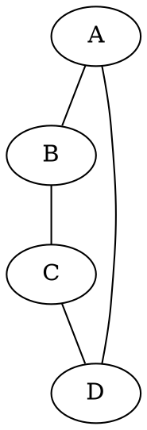
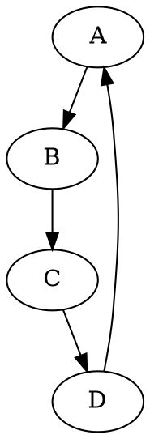
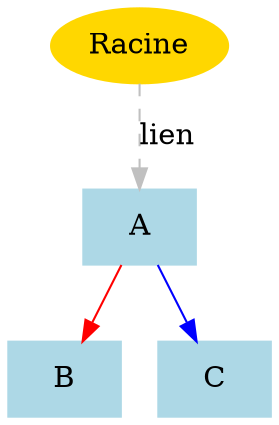
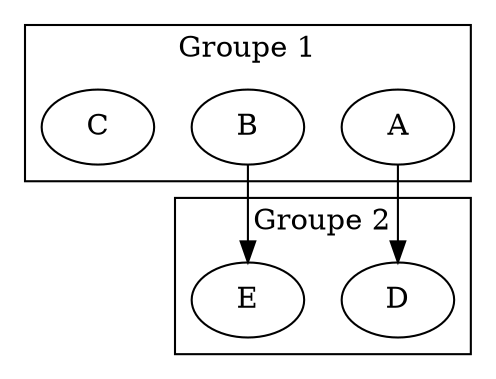
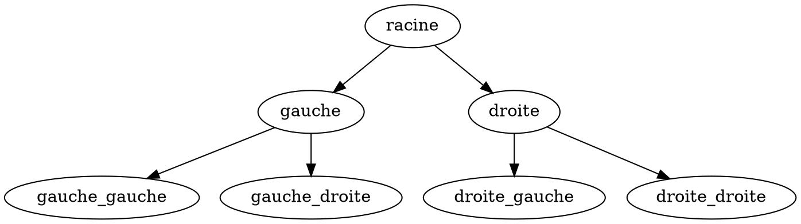

import { Tabs, Tab } from 'nextra/components'
import { ComponentProperties } from '../../../components'
import { useAbsoluteUrl } from '../../../hooks'

# GraphViewer

`wc-graph-viewer`

Visualiseur de graphes utilisant le format DOT pour représenter des structures de données complexes. Particulièrement utile pour les exercices d'algorithmique, de théorie des graphes, de structures de données, ou tout contexte nécessitant la visualisation de relations entre objets comme des arbres généalogiques ou des réseaux.

## Documentation

Le composant GraphViewer permet de visualiser des graphes et diagrammes à partir d'une description textuelle utilisant la syntaxe DOT de Graphviz. Cette approche facilite la représentation visuelle de structures relationnelles complexes sans avoir à manipuler directement des éléments graphiques.

### Propriété principale

- **graph**: Description du graphe au format DOT (langage de description de Graphviz)

### Syntaxe de base

Le format DOT permet de définir facilement différents types de graphes:

#### Graphe non orienté



#### Graphe orienté (digraph)



### Personnalisation visuelle

Vous pouvez personnaliser l'apparence des nœuds et des arêtes:



### Structures avancées

#### Sous-graphes



#### Arbre binaire



### Applications pédagogiques

Le composant GraphViewer est idéal pour:

- Illustrer des structures de données (arbres, graphes, réseaux)
- Représenter des algorithmes de parcours
- Visualiser des relations conceptuelles
- Montrer des organigrammes ou workflows
- Présenter des automates à états finis
- Illustrer des hiérarchies ou des dépendances

### Ressources pour approfondir

- [Guide complet de la syntaxe DOT](https://graphviz.org/doc/info/lang.html)
- [Tutoriel Graphviz en français](https://cyberzoide.developpez.com/graphviz/)
- [Galerie d'exemples Graphviz](https://graphviz.org/gallery/)

La puissance du langage DOT permet de créer rapidement des visualisations complexes à partir d'une description textuelle simple, facilitant ainsi l'intégration de schémas dynamiques dans vos ressources pédagogiques.

## Exemple interactif

<iframe
  src={useAbsoluteUrl('playground/components/wc-graph-viewer')}
  style={{ width: '100%', height: '700px', border: 'none' }}
></iframe>

## API

<Tabs items={['Graphique', 'JSON']}>
  <Tab>
    <ComponentProperties schema={{
  "$schema": "http://json-schema.org/draft-07/schema",
  "type": "object",
  "required": [
    "graph"
  ],
  "properties": {
    "graph": {
      "type": "string",
      "default": "",
      "description": "Le graph à dessiner au format dot."
    }
  }
}} />
  </Tab>
  <Tab>
    ```json
    {
  "$schema": "http://json-schema.org/draft-07/schema",
  "type": "object",
  "required": [
    "graph"
  ],
  "properties": {
    "graph": {
      "type": "string",
      "default": "",
      "description": "Le graph à dessiner au format dot."
    }
  }
}
    ```
  </Tab>
</Tabs>
