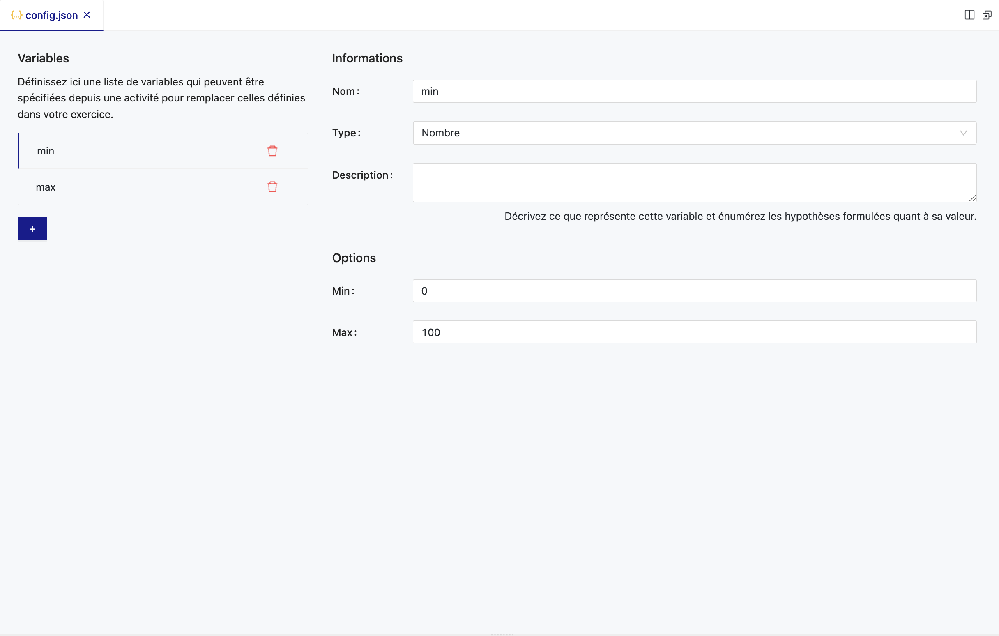

# Système de Configuration des Exercices avec config.json dans PLaTon

La personnalisation des exercices dans PLaTon peut être effectuée par le biais du fichier config.json, qui définie un ensemble de variables paramétrables. Cela permet aux utilisateurs, même sans compétences en programmation PLaTon, de configurer et d'ajuster les exercices selon leurs besoins.

## Processus de Configuration

- Création de config.json : Commencez par créer un fichier config.json dans le répertoire de votre exercice.
- Définition des Variables : Définissez une liste de variables avec des attributs spécifiques qui correspondent aux éléments paramétrables de l'exercice.


## Processus d'Intégration dans une Activité

- Intégration dans une Activité : Lors de l'intégration de l'exercice dans une activité, les variables configurables sont affichées dans un formulaire.
- Il est possible de prévisualiser l'exercice avec les valeurs modifiées afin de s'assurer que les paramètres sont corrects et de les ajuster si nécessaire.
- Lorsque l'activité est lancée, les valeurs configurées sont injectées dans l'exercice et peuvent être utilisées dans le code de l'exercice.


Cette méthode évite de dupliquer inutilement du code, simplifiant ainsi la gestion et la mise à jour des exercices. Une autre alternative aurait été de permettre la création d'une ressource exercice à partir d'un template
et ensuite de la modifier puis intégrer cette modification dans une activité. Cependant, une telle solution encourage la duplication d'exercice en poussant chaque utilisateur à créer sa propre ressource exercice à partir du template.

## Aperçu de config.json



Le fichier config.json est un template de configuration qui expose des variables pouvant être ajustées lors de l'intégration de l'exercice dans une activité.
Ces variables peuvent remplacer les valeurs par défaut établies dans le fichier main.ple de l'exercice.

## Interface de Configuration

Lorsque vous ouvrez `config.json` dans PLaTon, vous êtes accueilli par un formulaire avec les éléments suivants :

- Liste des Variables : Un espace à gauche où vous pouvez ajouter, supprimer ou réorganiser les variables configurables de l'exercice.
- Informations sur les Variables :
  - Nom : Identifie la variable (ex. min, max).
  - Type : Spécifie le type de la variable (Nombre, Texte, Code, Booléen, Fichier, JSON).
  - Description : Un champ pour décrire la variable et énoncer les hypothèses sur sa valeur.

- Options pour les Variables :
  - Min et Max : Pour les variables de type Nombre, définissez les valeurs minimales et maximales autorisées.

## Types de Variables Disponibles

- Nombre : Variables numériques avec ou sans contraintes de limite.
- Texte : Chaînes de caractères.
- Code : Snippets de code qui peuvent être insérés dans l'exercice.
- Booléen : Valeurs vraies ou fausses.
- Fichier : Permet d'intégrer des URL ou du contenu de fichier directement.
- JSON : Structures de données complexes sous forme d'objets JSON.

## Exemple d'Utilisation

Les possibilités offertes par le fichier config.json dans la création d'exercices PLaTon sont vastes.
Voici quelques exemples d'utilisation supplémentaires pour illustrer la flexibilité de cet outil.
Pour chaque exemple, nous fournissons un contexte, une configuration config.json et une application de l'exercice :

### Exemple 1: Exercice de Mathématiques

**Contexte** :

Un professeur souhaite créer une série d'exercices sur les équations du second degré où les élèves doivent trouver les racines.

**Configuration config.json** :

- Variables pour les coefficients a, b, et c de l'équation ax² + bx + c = 0.
- Un booléen pour activer ou non les aides.

**Application** :

```json
{
  "a": {
    "type": "Nombre",
    "min": -10,
    "max": 10,
    "description": "Coefficient de x²"
  },
  "b": {
    "type": "Nombre",
    "min": -10,
    "max": 10,
    "description": "Coefficient de x"
  },
  "c": {
    "type": "Nombre",
    "min": -10,
    "max": 10,
    "description": "Terme constant"
  },
  "showHints": {
    "type": "Booléen",
    "description": "Afficher les aides pour la résolution des équations"
  }
}
```

### Exemple 2: Exercice de Compréhension de Texte

**Contexte** :

Un exercice où les élèves doivent analyser un texte et répondre à des questions de compréhension.

**Configuration config.json** :

- Une variable de type Texte pour le passage à lire.
- Une variable de type Fichier pour charger des questions à choix multiples en format JSON.

**Application** :

```json
{
  "texte": {
    "type": "Texte",
    "description": "Le passage que les élèves doivent lire."
  },
  "questions": {
    "type": "Fichier",
    "description": "Un fichier JSON contenant les questions et options de réponse."
  }
}
```

### Exemple 3: Exercice de Programmation

**Contexte** :

Les élèves doivent écrire un script pour résoudre un problème de programmation spécifique.

**Configuration config.json** :

- Une variable de type Code pour le squelette de code initial.
- Un booléen pour choisir si le mode débogage est activé.

**Application** :

```json

{
  "skeletonCode": {
    "type": "Code",
    "description": "Le squelette de code initial que les étudiants doivent compléter."
  },
  "debugMode": {
    "type": "Booléen",
    "description": "Activer ou désactiver le mode débogage pour cet exercice."
  }
}
```


### Exemple 4: Exercice de Langues

**Contexte** :

Un exercice de langue où les élèves doivent traduire des phrases d'une langue à une autre.

**Configuration config.json** :

- Une variable de type Texte pour la phrase originale.
- Une variable de type Texte pour la phrase cible attendue.

**Application** :

```json
{
  "sourcePhrase": {
    "type": "Texte",
    "description": "La phrase à traduire."
  },
  "targetPhrase": {
    "type": "Texte",
    "description": "La traduction attendue de la phrase."
  }
}
```

Chaque exemple montre comment config.json peut être utilisé pour créer des modèles d'exercices flexibles qui peuvent être facilement adaptés et réutilisés pour différents besoins pédagogiques, sans nécessiter que les utilisateurs finaux modifient le code de l'exercice lui-même.

## Bonnes Pratiques

- Clarté des Noms : Nommez les variables de manière intuitive pour que leur fonction soit évidente.
- Descriptions Utiles : Fournissez des descriptions claires pour guider les utilisateurs sur la manière d'utiliser chaque variable.
- Validation des Valeurs : Si possible, définissez des validations dans le code de l'exercice pour vous assurer que les valeurs saisies sont dans les plages attendues.

En suivant ces étapes et recommandations, les utilisateurs peuvent créer des exercices PLaTon personnalisables et adaptés à divers scénarios pédagogiques, rendant la plateforme plus accessible et flexible.
