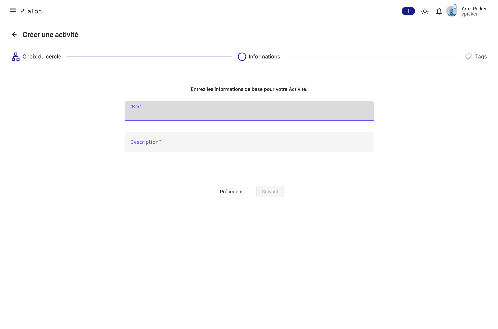

import { Callout } from 'nextra/components'

# Gestion des activités

## Création

### Comment créer une activité ?

#### Étape 1: Choix du Cercle Parent

- Accédez à l'option "Créer une activité" dans la barre de menu de PLaTon en cliquant sur le bouton `+`.
- Sélectionnez le cercle parent dans lequel vous souhaitez ajouter votre activité.
- Cliquez sur 'Suivant' pour continuer.

<Callout type="info">
  Si vous ouvrez le formulaire de création d'activité à partir de la page d'une ressource, le cercle parent sera
  automatiquement sélectionné comme étant le cercle dans lequel se trouve la ressource.
</Callout>

#### Étape 2: Entrer les Informations de Base

- Remplissez le nom de l'activité. Ce nom devrait être descriptif et refléter le contenu de l'activité.
- Fournissez une description claire et concise de l'activité pour informer les utilisateurs de son contenu et de son objectif.
- Cliquez sur 'Suivant' pour passer à l'étape suivante.

#### Étape 3: Associer des Tags

- Décidez si vous voulez associer des tags à votre activité dès maintenant. Les tags facilitent la recherche et la classification des ressources.
- Sélectionnez une liste de 'topics' (sujets) et de 'levels' (niveaux) pour classifier votre activité. Cela aidera les autres utilisateurs à trouver l'activité lorsqu'ils recherchent des ressources spécifiques.
- Après avoir sélectionné les tags appropriés, cliquez sur 'Créer' pour finaliser la création de votre activité.

<Callout type="info">
  Vous pouvez toujours ajouter des tags à votre activité plus tard en accédant à la page des paramètres de l'activité.
</Callout>

En suivant ces étapes, vous aurez créé un activité dans PLaTon, prêt à être peuplé avec des exercices pour vos étudiants ou collègues.
Rendez-vous dans la documentation sur la programmation des activités pour en savoir plus.
