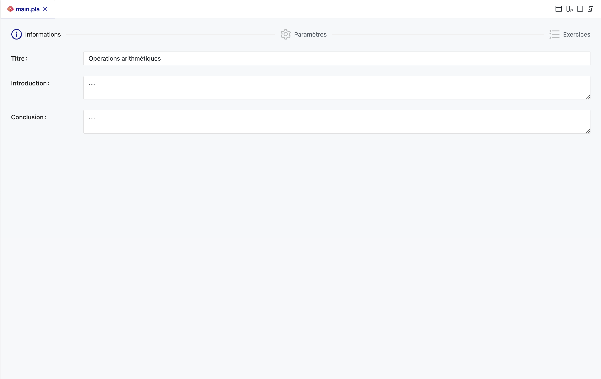

# Configuration d'une activité

Contrairement à un exercice, une activité est écrite entièrement avec un formulaire graphique, sans avoir à écrire du code.
Le rôle d'une activité est de piloter l'enchaînement des exercices et de contrôler leur comportement comme par exemple le nombre de tentatives autorisées, le temps accordé, etc.

Pour ce faire, ouvrez le fichier `main.pla` de votre activité pour afficher un formulaire de configuration contenant différents onglets :

## Informations

- **Titre** : Le titre de l'activité.

- **Introduction** : Une introduction à l'activité en format Markdown.
- **Conclusion** : Une conclusion à l'activité en format Markdown.

## Paramètres

### Réglez le Temps :

- **Durée** : Définissez la durée totale accordée pour l'activité (hh:mm:ss). Laisser vide pour illimité.

### Configurez la Navigation :

- **Mode** : Choisissez entre les modes de navigation :
  - **Composée** : Tous les exercices sont affichés sur une seule page.
  - **Séquentielle** : Les exercices sont affichés un par un.
  - **Intelligente** : Les exercices sont affichés un par un et ordonnés en fonction des réponses précédentes. Voir [Navigation Intelligente](/doc/programing/activity/next-navigation/next).

### Définissez les Actions :

- **Tentatives** : Indiquez le nombre de tentatives autorisées (-1 pour illimité).
- **Aides** : Cochez si vous souhaitez activer l'affichage des aides.
- **Autre question** : Autorisez ou non la génération d'une autre question.
- **Théories** : Activez l'affichage des théories associées aux questions.
- **Solution** : Permettez l'accès à la solution des exercices.

### Ajustez l'affichage de Feedback :

- **Validation** : Cochez pour fournir un feedback après chaque tentative si défini dans l'exercice.
- **Correction** : Activez pour que les feedbacks soient affichées à la fin de l'activité si défini dans l'exercice.

## Paramètres de Sécurité :

La configuration d'une activité sur PLaTon comporte plusieurs options de sécurité qui contrôlent le comportement de l'activité en cas d'interactions spécifiques de l'utilisateur avec la plateforme ou l'appareil.
Voici les détails de ces options :

- **Blocage du copier/coller** :
  Empêchez la copie et le collage de contenu dans toute la page web de l'activité.
- **Terminer si clic en dehors** :
  Lorsque cette option est activée, si l'utilisateur clique en dehors de la fenêtre de l'activité – par exemple,
  s'il passe à une autre application ou consulte une autre fenêtre – l'activité en cours sera automatiquement terminée.
  Cette option vise à maintenir la concentration de l'utilisateur sur l'activité et à prévenir la triche ou la distraction.

- **Terminer si changement de page** :
  Cette option, lorsqu'elle est sélectionnée, entraînera la fin de l'activité si l'utilisateur quitte la page de l'activité, comme en naviguant vers un nouvel onglet du navigateur ou en fermant le navigateur lui-même.
  L'objectif est d'assurer que l'utilisateur reste engagé dans l'activité sans interruption ou distraction par d'autres contenus en ligne.

Ces options de sécurité sont conçues pour renforcer l'intégrité de l'expérience d'apprentissage et pour s'assurer que l'utilisateur reste dans l'environnement contrôlé de l'activité pendant toute sa durée.
Elles sont particulièrement utiles dans les contextes d'évaluation où l'attention et l'engagement continus sont essentiels.

## Scénarios d'applicatons des options de sécurité

Pour vous aider dans la compréhension des options de sécurité, voici des situations où les options de sécurité "Terminer si clic en dehors" et "Terminer si changement de page" peuvent entraîner la fin d'une activité sur PLaTon,
accompagnées d'exemples concrets et de conseils à communiquer aux apprenants :

### Terminer si clic en dehors

- Cas d'usage :

- Changement d'application : Si un apprenant passe de PLaTon à une autre application, comme un traitement de texte ou un tableur.
  _Exemple_ : Un apprenant ouvre une calculatrice pour aider à résoudre un problème de mathématiques.

- Navigation vers un autre programme : Lorsqu'un apprenant bascule vers un autre programme sur son ordinateur.
  _Exemple_ : Un apprenant vérifie ses notifications ou met en pause sa musique via une autre application.

- Utilisation de la console du navigateur : Si un apprenant ouvre la console du navigateur pendant l'activité.
  _Exemple_ : Un apprenant ouvre la console du navigateur pour essayer de manipuler le document HTML. Étant donnée que la console ne fait pas partie de la zone de l'activité, cela entraînera la fin de l'activité.

### Terminer si changement de page

Cas d'usage :

- **Navigation vers un autre onglet du navigateur** : Si un apprenant clique sur un autre onglet pendant l'activité.
  _Exemple_ : L'apprenant recherche une formule sur une page web différente.

- **Fermeture du navigateur ** : Lorsqu'un apprenant ferme le navigateur où se déroule l'activité.
  _Exemple_ : Un apprenant ferme par erreur l'onglet de l'activité.

- **Actualisation de la page** : Si l'apprenant actualise la page de l'activité.
  _Exemple_ : L'apprenant rafraîchit la page pour essayer de résoudre un problème d'affichage.

### Conseils pour les Apprenants

- **Compréhension claire** : Assurez-vous que tous les apprenants comprennent le fonctionnement de ces options de sécurité avant de commencer une activité. Cela devrait être une partie essentielle de l'introduction à toute activité sur PLaTon.
- **Environnement de travail préparé** : Encouragez les apprenants à préparer tout le matériel dont ils pourraient avoir besoin avant de commencer l'activité pour éviter de devoir naviguer ailleurs.
- **Avertissement sur les conséquences** : Informez les apprenants que toute navigation hors de l'activité ou actualisation de la page mettra fin à l'activité et pourrait affecter leur performance.
- **Tests préliminaires** : Conseillez aux apprenants d'effectuer des tests avec des activités de pratique pour se familiariser avec ces restrictions et vous pouvez vous même effectuer des tests en tant qu'enseignant pour vous assurer que les activités fonctionnent comme prévu.

En communiquant efficacement sur ces fonctionnalités et en préparant les apprenants à leur utilisation, on peut minimiser les terminaisons inattendues et assurer une expérience d'apprentissage fluide et sans interruption.
