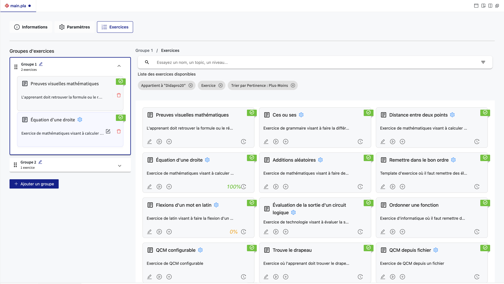

# Ajout d'Exercices à une Activité

La phase finale de la configuration d'une activité sur PLaTon implique l'ajout d'exercices.
Ces exercices peuvent être organisés en groupes, une fonctionnalité qui prévoit la possibilité d'une navigation dynamique adaptée au progrès de l'apprenant dans de futures mises à jour de PLaTon.
Voici comment ajouter et organiser des exercices au sein d'une activité :

## Création de Groupes d'Exercices

- **Ajout de Groupes** :
  - Commencez par ajouter des groupes pour organiser les exercices. Les groupes n'affectent pas directement l'activité pour le moment, mais seront utilisés par PLaTon à l'avenir pour une navigation adaptative.
- **Nommage des Groupes** :
  - Le nommage des groupes se fait automatiquement en fonction de l'ordre dans lequel ils sont créés. Vous pouvez les réorganiser en les faisant glisser et en les déposant dans l'ordre souhaité.

## Intégration d'Exercices

- **Sélection de Groupe** :
  - Cliquez sur un groupe pour commencer à y ajouter des exercices.
- **Rechercher des exercices**
  - La barre de recherche trouvera les exercices en fonctions de vos filtres, par défaut, nous vous affichons vos exercices du cercle dans lequel vous créez l'activité.
  - Vous pouvez ajouter des filtres en cliquant sur le bouton "filtre" à droite de la barre de recherche, un menu s'ouvre vous permettant de filtrer vos résultats.
  - Retirez les filtres précédemment ajouter en cliquant sur la croix en dessous de la barre de recherche.
- **Ajout d'Exercices** :
  - Utilisez le bouton d'ajout pour sélectionner et intégrer des exercices à un groupe spécifique (+), ou bien drag and drop les exercices dans un groupe.
- **Configurer les Exercices** :
  - Si un exercice est configurable, il est légèrement bleuté, vous pouvez cliquer sur le bouton `Éditer` à droite de celui-çi pour afficher les variables que vous pouvez personnaliser.
- **Prévisualisation** :
  - Avant de finaliser l'ajout, utilisez l'option de prévisualisation pour vérifier que l'exercice fonctionne comme prévu dans le contexte de l'activité.
  - Pour les exercices configurables, la prévisualisation se base sur les valeurs modifiées si elles sont définies, sinon sur les valeurs par défaut.
- **Validation des Exercices** :
  - Une fois les exercices ajoutés et configurés, validez votre sélection pour les inclure dans l'activité.

## Organisation et Révision

- **Réorganiser les Exercices** : Vous pouvez réorganiser l'ordre des exercices au sein d'un groupe pour structurer l'activité selon un parcours pédagogique spécifique.
- **Modifier ou Supprimer des Exercices** : À tout moment, vous avez la possibilité de modifier les paramètres d'un exercice ou de le supprimer du groupe si nécessaire.
- **Affichage des Variables** : Pour les exercices configurables, vous pouvez accéder et modifier les variables en cliquant sur "Afficher les variables" pour chaque exercice.

En suivant ces étapes, vous pouvez personnaliser de manière approfondie l'expérience d'apprentissage offerte par votre activité. Bien que les groupes n'ont pas d'impact immédiat sur la navigation de l'activité, il est conseillé de les utiliser pour préparer votre activité aux fonctionnalités à venir de PLaTon.
