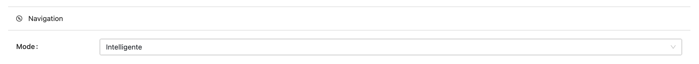

import { Callout } from 'nextra/components'

# Navigation intelligente - Next

La navigation intelligente (également appelée Next) est une fonctionnalité qui permet de guider l'utilisateur à travers une activité
en lui proposant des exercices en fonction de ses réponses précédentes.

## Principe

La navigation intelligente permet aux enseignants de programmer une logique d'enchaînement des exercices.
Cette logique peut s'appuyer sur diverses données, comme les notes obtenues dans les exercices précédents, pour déterminer les étapes suivantes.

## Utilisation

Pour activer la navigation intelligente, sélectionnez cette option dans les paramètres de l'activité :

## Configuration

Une fois la navigation intelligente activée, un onglet "Next" apparaît dans les paramètres de l'activité.
C'est dans cet onglet que se configure la navigation intelligente :

Dans cet onglet, plusieurs options sont disponibles :

- **Sandbox** : Permet de sélectionner le langage à utiliser pour programmer le *Next*.
- **Passer automatiquement** : Active ou désactive le passage automatique à l'exercice suivant dès que l'utilisateur termine celui en cours.
- **Note minimum pour passer automatiquement** : Détermine la note minimale requise pour activer le passage automatique à l'exercice suivant.

<Callout type="info">Les deux dernières options impactent uniquement le passage **automatique** des exercices.
Peu importe les paramètres configurés, l'étudiant pourra toujours cliquer sur la flèche pour accéder à l'exercice suivant.</Callout>

## Programmation

Une fois la configuration terminée, cliquez sur le bouton **Ouvrir le fichier Next** pour accéder à l'éditeur de code.

<Callout type="info">Une bibliothèque contenant des fonctions de base est disponible.
Vous pouvez consulter la liste complète des fonctions utilisables pour programmer le *Next* en [cliquant ici](/doc/programing/activity/next-navigation/nextlib).</Callout>
