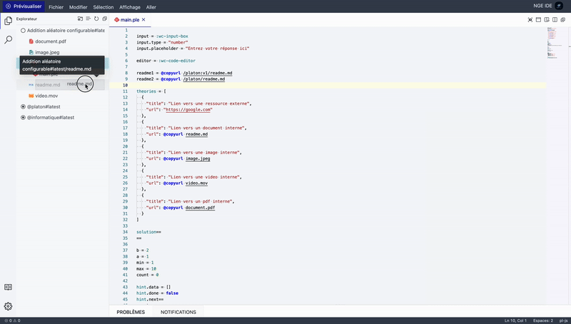

import { Tabs } from 'nextra/components'
import { Callout } from 'nextra/components'
import { FileTree } from 'nextra/components'

# Le langage ple (PLaTon Exercise)

Le langage PLE (PLaTon Exercise) est un langage déclaratif conçu pour créer des exercices interactifs sur la plateforme PLaTon. Cette documentation vous guidera à travers sa syntaxe et ses fonctionnalités.

Pour illustrer les concepts de base abordés dans cette documentation, nous allons partir d'un exemple simple d'exercice : une addition aléatoire.

```pl-js
# Choix de la sandbox
sandbox = "node"

# Initialisation des composants
input = :wc-input-box
input.type = "number"
input.placeholder = "Entrez votre réponse ici"

# Initialisation des composants de solution
inputSolution = :wc-input-box
inputSolution.type = "number"
inputSolution.disabled = true
inputSolution.placeholder = "Solution"

# Paramètrage des aides
hint = [
  @copycontent help.md,
  "Aide 2"
]

# Paramètrage des théories
theories = [
  { title: "Lien vers une ressource externe", url: "https://google.com" },
  { title: "Lien vers une ressource interne", url: @copyurl readme.md }
]

# Génération des nombres aléatoires
max = 10

builder == #!lang=js
a = Math.round(Math.random() * max)
b = Math.round(Math.random() * max)
inputSolution.value = a + b
==

# Évaluation de la réponse
grader == #!lang=js
grade = 0
feedback.type = "error"
feedback.content = "Mauvaise réponse"
if (input.value === inputSolution.value) {
  grade = 100
  feedback.type = "success"
  feedback.content = "Bonne réponse"
}
==

# Énoncé de l'exercice
title==
Addition aléatoire
==

statement ==
Combien font {{a}} + {{b}} ?
==

form==
{{input}}
==

solution==
{{inputSolution}}
==
```


## Deux contextes d'exécution importants

Avant d'aborder la syntaxe, il est crucial de comprendre les deux contextes dans lesquels s'exécute le code d'un exercice PLaTon:

1. **Contexte PLaTon** - Le code écrit directement dans le fichier `.ple` en dehors des blocs multilignes (opérateurs `==`)
   - Utilise uniquement la syntaxe déclarative PLE
   - Sert à définir les variables, composants, et structure de l'exercice
   - Exemple: `variable = 42`, `input = :wc-input-box`

2. **Contexte Sandbox** - Le code exécuté dans un environnement isolé, principalement dans les clés `builder`, `grader` et `hint.next`
   - Utilise la syntaxe complète du langage choisi (JavaScript ou Python)
   - S'exécute dans une sandbox spécifique (Node.js ou Python)
   - Exemple: `let sum = a + b;` (dans une sandbox Node)

Cette distinction est fondamentale pour éviter les erreurs courantes dans la création d'exercices.

## Syntaxe de base du contexte PLaTon

### Affectation de variables

L'affectation se fait avec le symbole `=`. Pas de point-virgule à la fin, pas de mot-clé `var`, `let`, ou `const`.

```pl-js
variable = 42
message = "Bonjour"
```

### Déclaration des clés principales d'un exercice

Un exercice se compose généralement de plusieurs clés essentielles:

```pl-js
title = "Mon exercice"     # Titre de l'exercice
statement = "Consigne..."  # Énoncé de l'exercice
form = "..."               # Zone de réponse
```

### Exemple d'exercice simple

```pl-js
# Configuration de la sandbox
sandbox = "node"

# Initialisation d'un composant pour la réponse
input = :wc-input-box
input.type = "number"
input.placeholder = "Entrez votre réponse"

# Définition du titre et de l'énoncé
title = "Addition simple"
statement = "Combien font 2 + 2 ?"

# Formulaire de réponse
form = "{{input}}"

# Vérification de la réponse (dans le contexte Sandbox)
grader == #!lang=js
if (input.value == 4) {
  grade = 100
  feedback.type = "success"
  feedback.content = "Bravo !"
} else {
  grade = 0
  feedback.type = "error"
  feedback.content = "Réessayez."
}
==
```

## Types de variables dans le contexte PLaTon

Le langage PLE supporte plusieurs types de données:

### Types primitifs
```pl-js
nombre = 42
decimal = 3.14
texte = "Bonjour monde"
booleen = true       # Peut aussi utiliser True/False (style Python)
```

### Nombres avec séparateurs
```pl-js
grand_nombre = 1_000_000  # Les underscores sont ignorés: équivalent à 1000000
```

### Tableaux
```pl-js
liste = [1, 2, 3, "texte", true]
```

### Objets
```pl-js
# Notation littérale
personne = {
  nom: "Dupont",
  age: 30,
  "adresse complete": "123 rue des Exemples"  # Les clés avec espaces doivent être entre guillemets
}

# Notation par points (dot notation)
voiture.marque = "Renault"
voiture.annee = 2020
```

### Composants d'interface
```pl-js
input = :wc-input-box
checkbox = :wc-checkbox
```

### Références de fichiers
```pl-js
contenu_fichier = @copycontent chemin/vers/fichier.txt
url_fichier = @copyurl chemin/vers/image.png
```

## Opérateur multiligne `==`

L'opérateur `==` permet de définir des chaînes ou des scripts multilignes sans avoir à échapper les caractères spéciaux.

### Pour du texte simple
```pl-js
description ==
Ceci est un texte
sur plusieurs lignes.
Sans besoin d'échapper les caractères spéciaux.
==
```

### Pour du code exécutable (avec coloration syntaxique)
```pl-js
grader == #!lang=js
// Ce code sera exécuté dans la sandbox JavaScript
let somme = a + b;
grade = (somme === input.value) ? 100 : 0;
==

builder == #!lang=py
# Ce code sera exécuté dans la sandbox Python
import random
a = random.randint(1, 10)
b = random.randint(1, 10)
==
```

## Variables et portée

### Règles importantes de portée des variables

1. **Variables déclarées dans le contexte PLaTon**
   - Accessibles dans tout l'exercice (contexte PLaTon et sandbox)
   - Peuvent être modifiées par les scripts de la sandbox

2. **Variables déclarées dans les scripts de la sandbox**
   - Si déclarées avec `var`, `let`, `const` (JS) ou comme variables locales Python:
     - Portée limitée au script où elles sont définies
     - Ne sont PAS accessibles dans les clés d'affichage ou autres scripts

   - Si déclarées sans mot-clé en JS ou comme variables globales en Python:
     - Deviennent accessibles globalement dans l'exercice
     - Peuvent être utilisées dans les clés d'affichage

### Exemples de portée (dans une sandbox JavaScript)

```pl-js
# Dans le contexte PLaTon
valeur_globale = 10

builder == #!lang=js
// Accessible partout car déclarée sans mot-clé
resultat = valeur_globale * 2;

// Variable locale - accessible uniquement dans ce script
let variable_locale = 42;

// Cette variable sera aussi locale au builder
const autre_variable = "texte";
==

# La variable "resultat" est accessible ici
statement = "Le résultat est {{resultat}}"

# ERREUR: variable_locale n'est pas accessible ici
# form = "{{variable_locale}}"
```

### Cas particulier pour grade et feedback dans le grader

Pour les variables `grade` et `feedback` dans le grader, utilisez toujours une déclaration globale:

```pl-js
grader == #!lang=js
// CORRECT - grade et feedback sont accessibles en dehors du grader
grade = 100;
feedback = { type: "success", content: "Bravo !" };

// INCORRECT - ces variables seront locales au grader et non récupérées par PLaTon
// let grade = 100;
// const feedback = { type: "success", content: "Bravo !" };
==
```

## Inclusion de fichiers

Pour inclure des fichiers dans l'environnement isolé de l'exercice:

```pl-js
# Inclure un fichier avec son nom d'origine
@include data.csv

# Inclure un fichier en le renommant
@include questions.json as examen.json
```

<Callout type="info">
  Il est possible de glisser déposer des fichiers depuis l'explorateur de fichier de l'IDE vers la zone dans laquelle
  vous souhaitez inclure le chemin du fichier.

  
</Callout>

### Lecture des fichiers inclus

Dans une sandbox JavaScript:
```pl-js
builder == #!lang=js
// Fonction spéciale disponible dans la sandbox Node
const contenu = readFile("data.csv");
==
```

Dans une sandbox Python:
```pl-js
builder == #!lang=py
# Utilisation standard de Python
with open("data.csv", "r") as f:
    contenu = f.read()
==
```

## Héritage et composition

### Héritage avec @extends

L'héritage permet d'importer toutes les clés d'un autre fichier PLE:

```pl-js
# Hérite de toutes les clés définies dans base.ple
@extends base.ple

# On peut ensuite surcharger certaines clés
title = "Nouvel exercice"
```

Exemple. L'exercice associé au fichier `main.ple` contiendra une clé `key1` valant `0` et une clé `key2` valant `"toto"`.

<Tabs items={['main.ple', 'parent.ple']}>
  <Tabs.Tab>
  ```
  @extends parent.ple
  key1 = 0
  ```
  </Tabs.Tab>
  <Tabs.Tab>
  ```
  key1 = 5
  key2 = "toto"
  ```
  </Tabs.Tab>
</Tabs>

<Callout type="info">Il est possible d'hériter en cascade de plusieurs fichiers.</Callout>

### Composition

La composition permet d'importer les clés d'un fichier dans une variable:

```pl-js
# Les clés de template.ple sont stockées dans la variable 'modele'
modele = @extends template.ple

# Accès aux clés du modèle
statement = "Nouvelle consigne utilisant {{modele.variable}}"
```

## Référencement de fichiers

Comme vue précédemment, certains opérateurs se servent de fichiers, il est donc important de savoir comment référencer ces fichiers dans les exercices.

Il y a quatre manière de référencer un fichier:

- Avec un chemin relatif à l'exercice
  - ex: `readme.md`
- Avec un chemin absolue vers un fichier du cercle parent de l'exercice, commençant par `/CODE_DU_CERCLE`
  - ex: `/informatique/chemin/vers/fichier.ext`
- Avec un chemin absolue vers une version particulière d'un fichier du cercle parent de l'exercice, commençant par `/CODE_DU_CERCLE:VERSION`
  - ex: `/informatique:v1/chemin/vers/fichier.ext`

Ainsi, avec une arbre de répertoires comme celui-ci:

- monexo est la racine de l'exercice
- informatique est le cercle parent de l'exercice
- platon est le cercle parent du cercle informatique
- #latest indique qu'on visualise la dernière version du cercle

<FileTree>
  <FileTree.Folder name="monexo" defaultOpen>
    <FileTree.File name="main.ple" />
    <FileTree.File name="readme.md" />
  </FileTree.Folder>
  <FileTree.Folder name="@informatique#latest" defaultOpen>
    <FileTree.Folder name="templates">
      <FileTree.File name="base.ple" />
    </FileTree.Folder>
    <FileTree.File name="readme.md" />
  </FileTree.Folder>
  <FileTree.Folder name="@platon#v1" defaultOpen>
    <FileTree.Folder name="templates">
      <FileTree.File name="qcm.ple" />
    </FileTree.Folder>
    <FileTree.File name="readme.md" />
  </FileTree.Folder>
</FileTree>

- Il est possible de référencer `base.ple` du cercle informatique à l'intérieur de `main.ple` par :

```
/informatique/templates/base.ple
```

- Il est possible de référencer `readme.md` de l'exercice `monexo` à l'intérieur de `main.ple` par :

```
readme.md
```

- Il est possible de référencer `readme.md` du cercle `platon` à l'intérieur de `main.ple` par :

```
/platon:v1/readme.md
```

<Callout>
  Par défaut, si une version n'est pas précisée, la dernière version du fichier est utilisée (ex: `/platon/readme.md`
  utilise `/platon:latest/readme.md`).
</Callout>

## Ordre recommandé des clés

Bien que l'ordre des clés soit généralement flexible, certaines règles et bonnes pratiques s'appliquent:

1. **Règles obligatoires**
   - Les directives `@extends` doivent être en premier
   - Une clé parente doit être déclarée avant ses sous-clés

2. **Structure recommandée**
   - Configuration: `sandbox`, `@include`, `@extends`
   - Composants et variables: définitions des éléments d'interface et variables globales
   - Scripts: `builder`, `grader`
   - Support pédagogique: `hint`, `theories`, `solution`
   - Interface utilisateur: `title`, `statement`, `form`

### Exemple d'organisation

```pl-js
# 1. Configuration
@extends base.ple
sandbox = "node"
@include data.csv

# 2. Composants et variables
input = :wc-input-box
input.type = "text"
max_score = 100

# 3. Scripts
builder == #!lang=js
// Génération de l'exercice
==

grader == #!lang=js
// Évaluation de la réponse
==

# 4. Support pédagogique
hint = ["Indice 1", "Indice 2"]
solution = "La solution est..."

# 5. Interface utilisateur
title = "Titre de l'exercice"
statement = "Consigne..."
form = "{{input}}"
```

## Création de composants dans les deux contextes

### Dans le contexte PLaTon
```pl-js
input = :wc-input-box
input.type = "number"
```

### Dans le contexte Sandbox
```pl-js
builder == #!lang=js
// Utiliser la fonction component() au lieu de l'opérateur :
const newInput = component("wc-input-box");
newInput.type = "number";
==
```

## Résumé des erreurs fréquentes

1. **Confusion des contextes**
   - Utiliser les syntaxes JavaScript/Python directement dans le contexte PLaTon
   - Ne pas utiliser les mot-clés appropriés dans la sandbox

2. **Problèmes de portée**
   - Déclarer `grade` ou `feedback` comme variables locales dans le grader
   - Essayer d'accéder à des variables locales de la sandbox dans les clés d'affichage

3. **Ordre des clés**
   - Essayer d'accéder aux sous-clés avant de déclarer la clé parente
   - Placer les directives `@extends` après d'autres déclarations

4. **Syntaxe invalide**
   - Utiliser des point-virgules ou des mots-clés comme `var`, `let`, ou `const` dans le contexte PLaTon
   - Confondre les opérateurs spéciaux du langage PLE avec des fonctions
