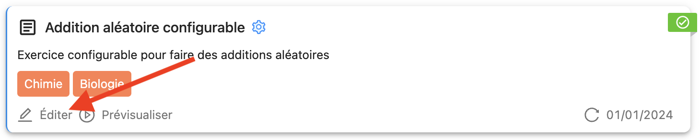
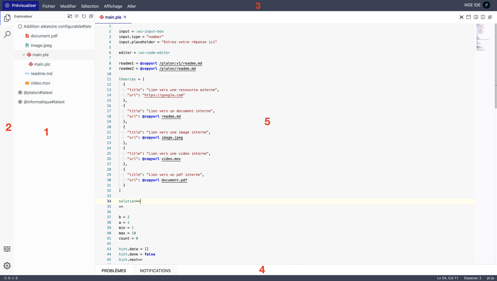

import { Callout } from 'nextra/components'

# L'Environnement de Développement

La conception d'exercices et activité PLaTon se fait dans un environnement de développement intégré (IDE) qui permet de créer, modifier et tester les exercices et activités.

Cet environnement est accessible de différentes manières :

- Depuis le bouton `Éditer` sur les resources de la plateforme
  

- Depuis la barre d'actions de la page de détails d'une ressource
  

- Depuis l'onglet `Explorer` sur la page de détails d'une ressource
  

<Callout type="info">L'IDE est accessible uniquement pour les administrateurs et les enseignants.</Callout>

## Présentation de l'IDE

L'Environnement de Développement Intégré de PLaTon, est conçu avec l'inspiration du très populaire Visual Studio Code avec la librarie [nge-ide](https://github.com/cisstech/nge-ide). Faisons le tour des fonctionnalités clés qui rendront votre expérience de codage efficace et agréable.

## Fonctionnalités clés

### 1. La Barre Latérale - Votre Hub de Navigation

Sur le côté gauche, vous trouverez la barre latérale, un hub de navigation polyvalent avec plusieurs sections :

- **Explorateur** : Votre point d'interaction principal pour tous vos fichiers et projets.
- **Recherche** : Trouvez rapidement du code, des fichiers ou même un texte spécifique dans vos fichiers.
  <Callout type="info">
    La recherche se limite pour le moment aux fichiers de la ressource courante et non aux cercles parents.
  </Callout>
- **Documentation** : Accédez aux différentes documentation de PLaTon directement dans l'éditeur pour vous aider dans la création de vos ressources.
- **Paramètres** : Personnalisez votre IDE selon vos préférences, en adaptant l'expérience à votre flux de travail.

### 2. Menu de l'Explorateur - Gestion de Fichiers Efficace

Dans l'Explorateur, vous avez plusieurs boutons pour rationaliser votre flux de travail :

- **Modifier les Dossiers Racines** : Importez les répertoires des cercles parents de la ressource courante pour n'afficher que ce qui est pertinent pour votre exercice.
  <Callout type="info">
    L'éditeur sauvegarde les dossiers racines que vous avez ajoutés et les réaffiche automatiquement lorsque vous
    revenez à l'éditeur.
  </Callout>
- **Activer le Filtrage Clavier** : Affinez vos recherches et la navigation de fichiers avec des raccourcis clavier.
- **Actualiser** : Mettez à jour votre arborescence de fichiers pour refléter les nouveaux changements ou ajouts.
- **Tout Plier** : Réduisez tous les répertoires pour une vue simplifiée de la structure de votre projet.

### 3. Barre de Menu Supérieure - Le Classique Rencontre le Moderne

En haut, la barre de menu présente des options classiques complétées par une touche moderne :

- **Bouton de Prévisualisation** : Visualisez instantanément votre travail en action, un outil pratique pour le développement web et les fichiers markdown.
  <Callout type="info">Ce bouton est uniquement disponible pour les exercices et activités.</Callout>

### 4. Zone d'Information - Restez Informé

Le volet inférieur est votre zone d'information, vous tenant informé sur :

- **Problèmes** : Naviguez rapidement vers les erreurs ou les avertissements dans votre code.
- **Notifications** : Restez au courant des messages importants en provenace de l'IDE en fonction de vos actions.

### 5. Zone d'Édition Centrale - Polyvalente et Puissante

Le cœur de l'IDE est la zone d'édition centrale, où la polyvalence rencontre la puissance :

- Prise en charge de l'édition et de la visualisation d'une large gamme de fichiers, y compris le code, les PDF, les vidéos et les images.
  - Le meilleur moyen de savoir si un fichier est pris en charge est de l'ouvrir et de voir ce qui se passe ! Si l'IDE ne peut pas l'ouvrir, il affichera son contenu brut.
- Une barre d'outils adaptative qui fournit des actions spécifiques au fichier, comme des aperçus améliorés pour les fichiers markdown, HTML, SVG et les fichiers PLaTon.

## Questions Fréquentes

### 1. Comment puis-je ouvrir plusieurs fichiers à la fois ?

Lorsque vous ouvrez un fichier, un bouton  vous permet de diviser l'éditeur en deux. Vous pouvez ensuite ouvrir un autre fichier dans la nouvelle zone d'éditeur
après avoir cliquer à l'intérieur de la zone d'édition.

L'éditeur ouvrira toujours les nouveaux fichiers dans la zone d'édition active et il est possible d'avoir autant de zones d'édition que vous le souhaitez.

### 2. Comment puis-je importer un dossier complet depuis mon ordinateur ?

L'éditeur ne prend pas en charge l'importation de dossiers complets depuis votre ordinateur.
Cependant, vous pouvez importer un fichier zip et le décompresser dans l'éditeur en choisissant l'option `Extraire ici` dans le menu contextuel.

### 3. Pourquoi je ne peux pas éditer certains fichiers ?

Dans certains cas, l'éditeur affiche le contenu de vos fichier en lecture seule. Cela se produit notamment dans les cas suivants :

- Vous n'avez pas les droits d'édition sur la ressource car vous n'êtes pas collaborateur sur le cercle de la ressource.
- Vous êtes entrain de visualiser une version antérieure de la ressource. Seul la dernière version est éditable.
- Selon votre type de ressouce, certains fichiers spécifques ne peuvant pas être éditées, suppression ou renommés.
  - Pour les exercices et activités, les fichiers `main.ple` et `main.pla` ne peuvent pas être supprimés car c'est le point d'entrée.
  - Pour les exercies issues de templates, vous ne pouvez pas éditer le contenu du main.ple car il est généré automatiquement. L'édition se fait en ouvrant le fichier `main.plo` qui vous permet de l'éditer graphiquement.

### 4. Insertion de Fichiers par Glisser-Déposer

Enrichissez votre code en glissant et déposant des fichiers directement dans votre éditeur.
Il vous proposera une liste de choix pour insérer du code pertinent à l'emplacement du dépôt.

Cette documentation ne fait qu'effleurer la surface de ce qui est possible. Plongez, explorez et personnalisez l'IDE pour qu'il corresponde à votre style de programmation. Bon codage !
