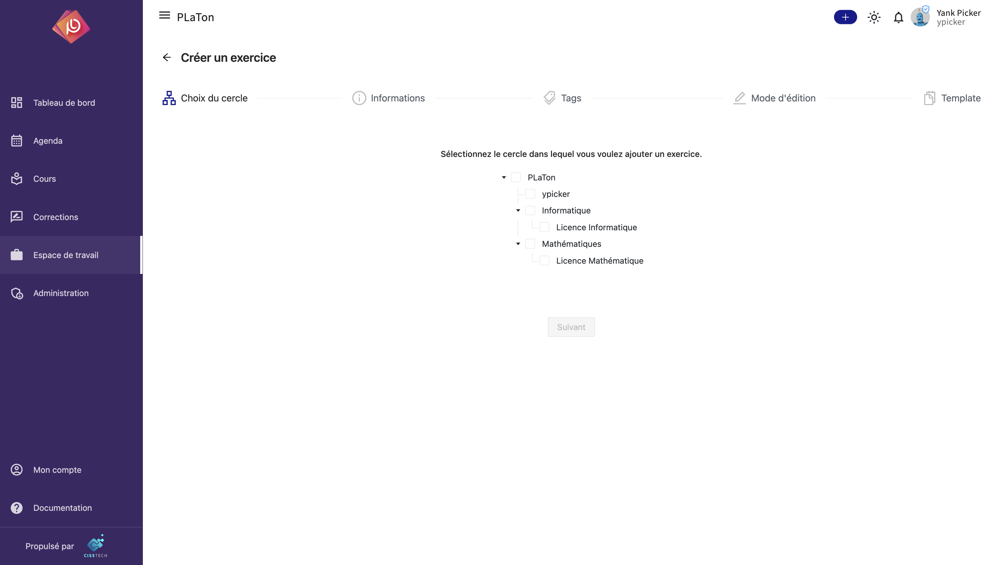
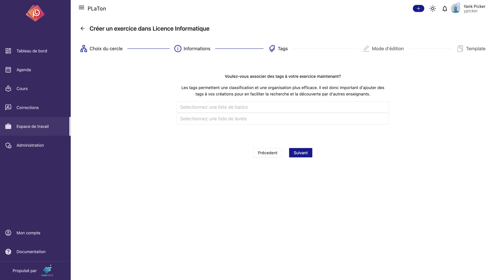
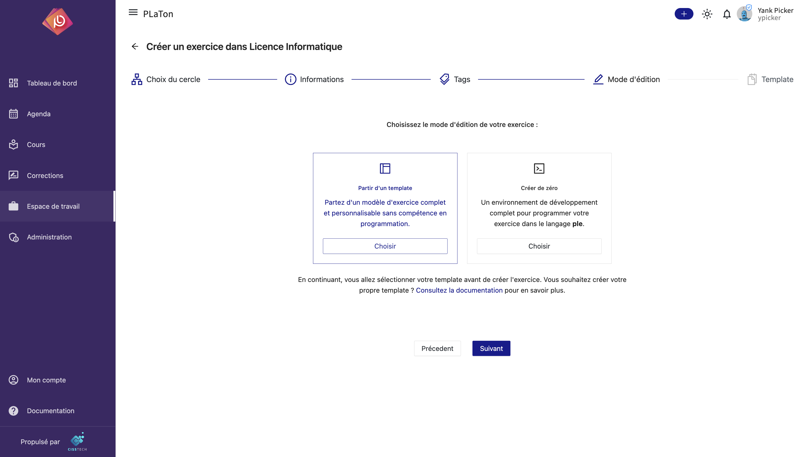

import { Callout } from 'nextra/components'

# Gestion des exercices

### Comment créer un exercice ?

#### Étape 1 : Choix du Cercle Parent

- Accédez à l'option "Créer un exercice" dans la barre de menu de PLaTon en cliquant sur le bouton `+`.
- Sélectionnez le cercle parent dans lequel vous souhaitez ajouter votre exercice.
- Cliquez sur 'Suivant' pour continuer.

<Callout type="info">
  Si vous ouvrez le formulaire de création d'exercice à partir de la page d'une ressource, le cercle parent sera
  automatiquement sélectionné comme étant le cercle dans lequel se trouve la ressource.
</Callout>

#### Étape 2 : Entrer les Informations de Base

- Remplissez le nom de l'exercice. Ce nom devrait être descriptif et refléter le contenu de l'exercice.
- Fournissez une description claire et concise de l'exercice pour informer les utilisateurs de son contenu et de son objectif.
- Cliquez sur 'Suivant' pour passer à l'étape suivante.

#### Étape 3 : Associer des Tags

- Décidez si vous voulez associer des tags à votre exercice dès maintenant. Les tags facilitent la recherche et la classification des ressources.
- Sélectionnez une liste de 'topics' (sujets) et de 'levels' (niveaux) pour classifier votre exercice. Cela aidera les autres utilisateurs à trouver le cercle lorsqu'ils recherchent des ressources spécifiques.
- Après avoir sélectionné les tags appropriés, cliquez sur 'Créer' pour finaliser la création de votre exercice.

<Callout type="info">
  Vous pouvez toujours ajouter des tags à votre exercice plus tard en accédant à la page des paramètres du exercice.
</Callout>

#### Étape 4 : Choix du mode d'édition

- Choisissez la manière dont vous souhaitez créer votre exercice entre :
  - Partir d'un template : vous pouvez choisir un template d'exercice existant et le modifier selon vos besoins de manière graphique et intuitive sans avoir à écrire de code.
  - Partir de zéro : vous pouvez créer votre exercice à partir de zéro en écrivant directement le code de l'exercice dans l'environnement de développement intégré de PLaTon.
- Si vous choisissez de créer à partir de zéro, vous pouvez créer l'exercice à cette étape en cliquant sur 'Créer' pour terminer le processus de création.
  Un modèle d'exercice par défaut sera créé pour vous. Vous pouvez ensuite le modifier à votre guise.
- Sinon, cliquez sur 'Suivant' pour passer à l'étape suivante et choisir un template.

<Callout type="info">
  Vous pouvez changer le modèle par défaut des exercices en créant un fichier `default.ple` à la racine de votre cercle personnel.
  Il sera appliqué à tous les exercices que vous créez partout dans PLaTon.

  Vous pouvez aussi mettre un fichier `default.ple` dans un cercle quelconque pour changer le modèle par défaut des exercices de ce cercle.
  Il sera appliqué en priorité par rapport au fichier `default.ple` de votre cercle personnel.
</Callout>

#### Étape 5 : Choix d'un template

- Cette étape n'est disponible que si vous avez choisi de créer votre exercice à partir d'un template.
- Ici, vous pouvez choisir un template d'exercice existant et le modifier selon vos besoins de manière graphique et intuitive sans avoir à écrire de code.
- Les templates sont des exercices pré-construits disponibles dans l'un des cercles parent de l'exercice.

<Callout type="info">
  Vous souhaitez créer un template d'exercice ? Rendez-vous dans la documentation sur [la création de templates
  d'exercice](/doc/programing/exercise/config).
</Callout>

En suivant ces étapes, vous aurez créé un exercice dans PLaTon, prêt à être programmé.
Rendez-vous dans la documentation sur la programmation des exercices pour en savoir plus.
