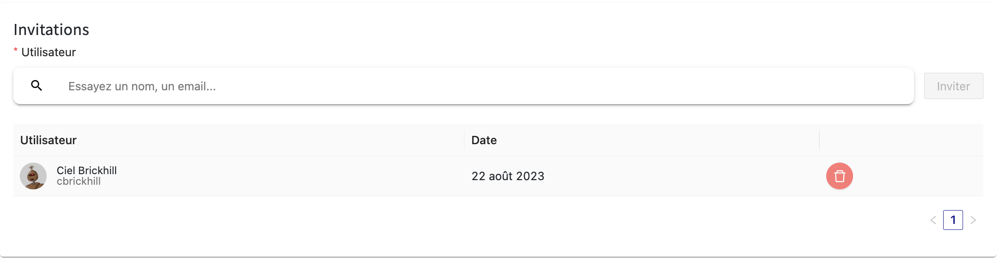
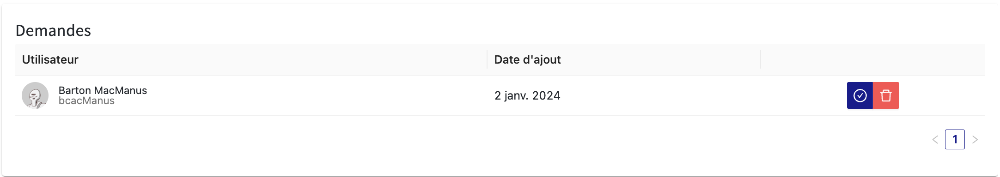

# Collaboration dans les Cercles de PLaTon

## Accès et Permissions

Dans PLaTon, bien que tous les cercles soient visibles pour consultation par les utilisateurs de la plateforme,
seuls les collaborateurs et les administrateurs d'un cercle donné ont la capacité de modifier les informations du cercle ou de publier des ressources en son sein.
Cela garantit que la gestion des contenus est réalisée par des utilisateurs autorisés, maintenant ainsi l'intégrité et la qualité des ressources éducatives.

## Devenir Collaborateur d'un Cercle

Il existe deux méthodes pour obtenir le statut de collaborateur dans un cercle :

### 1. Invitation par un Administrateur

#### Processus d'Invitation

- Un administrateur du cercle accède à la page des collaborateurs, où il peut voir la liste des membres actuels et inviter de nouveaux collaborateurs.
  Pour envoyer une invitation, l'administrateur entre le nom ou l'e-mail de l'utilisateur et sélectionne 'Inviter'.

- Une fois l'invitation envoyée, l'administrateur peut voir la liste des invitations en attente, avec la possibilité de les annuler.

#### Réception et Gestion des Invitations

- L'utilisateur invité reçoit une notification, laquelle contient des boutons 'Accepter' ou 'Refuser', lui permettant de choisir de rejoindre le cercle en tant que collaborateur ou de décliner l'invitation.
  

### 2. Demande d'Adhésion Personnelle

#### Faire une Demande

- Un utilisateur souhaitant devenir collaborateur d'un cercle peut initier une demande en naviguant sur la page du cercle et en cliquant sur le bouton 'Demander à rejoindre' situé dans la barre des actions.
  

- Une fois la demande soumise, l'utilisateur peut l'annuler à tout moment en cliquant sur le bouton 'Annuler la demande de rejoindre' situé dans la barre des actions.
  

#### Notification et Approbation des Demandes

- Une fois la demande soumise, les administrateurs du cercle reçoivent une notification. Ils peuvent alors consulter la demande dans la page des collaborateurs et décider de l'accepter ou de la refuser.
  

- Les demandes approuvées permettent à l'utilisateur de devenir collaborateur, avec la possibilité de modifier les informations du cercle et de contribuer au contenu.

## Rôles et Responsabilités

En tant que collaborateur, un utilisateur acquiert des responsabilités supplémentaires au sein du cercle, telles que la maintenance du contenu et l'interaction avec les autres membres.
Les administrateurs, quant à eux, gardent une vue d'ensemble et un contrôle sur la gestion des collaborateurs, s'assurant que le cercle reste un espace productif et conforme à ses objectifs pédagogiques.
