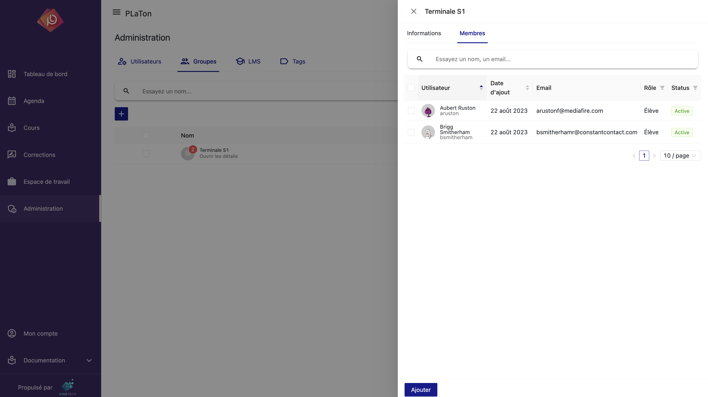

# Gestion des Groupes Utilisateurs

La gestion des groupes utilisateurs est une fonctionnalité clé pour les administrateurs sur PLaTon.
Elle permet de regrouper les utilisateurs selon divers critères et besoins, tels que des classes, des groupes de travaux pratiques, ou des équipes d'enseignants.
Ce chapitre aborde la création, la modification et la gestion des membres des groupes, ainsi que les différents cas d'utilisation.

## Création et Modification de Groupes

### Création de Groupe

- Ajout d'un Nouveau Groupe : Les administrateurs peuvent créer de nouveaux groupes en spécifiant des informations telles que le nom du groupe, sa description, et son objectif.
- Paramètres du Groupe : Il est possible de définir des paramètres spécifiques pour chaque groupe, comme des règles d'accès ou des rôles spéciaux au sein du groupe.

### Modification de Groupe

- Édition des Informations : Les administrateurs peuvent modifier les informations d'un groupe à tout moment, y compris son nom, sa description et ses paramètres.
- Suppression de Groupe : Un groupe peut être supprimé si nécessaire. Cette action doit être effectuée avec prudence car elle peut affecter l'accès des utilisateurs aux ressources liées au groupe.

## Gestion des Membres du Groupe

## Ajout et Suppression de Membres

- Assignation des Membres : Les administrateurs peuvent ajouter des utilisateurs aux groupes, soit individuellement, soit en masse.
- Retrait de Membres : De même, les membres peuvent être retirés d'un groupe si leur participation n'est plus nécessaire ou appropriée.

## Cas d'Utilisation des Groupes

### Exemples Pratiques

- Classes : Création de groupes pour des classes spécifiques, facilitant la gestion des cours et des ressources pour un ensemble d'étudiants.
- Groupes de Travaux Pratiques : Formation de petits groupes pour des sessions de travaux pratiques ou des projets de groupe.
- Groupe d'Enseignants : Regroupement des enseignants par département ou par matière pour faciliter la collaboration et le partage de ressources.
- Correcteurs : Création de groupes de correcteurs pour des évaluations ou des examens, permettant une répartition efficace des tâches de correction.

## Interface de Gestion des Groupes

### Conception et Fonctionnalités

- Interface Intuitive : L'interface de gestion des groupes est conçue pour être facile à utiliser, permettant une gestion rapide et efficace des groupes et de leurs membres.
- Visibilité et Contrôle : Les administrateurs ont une vue complète sur tous les groupes existants sur la plateforme et peuvent gérer ces groupes de manière centralisée.
  La gestion des groupes utilisateurs est un outil puissant dans PLaTon, offrant aux administrateurs la flexibilité nécessaire pour organiser les utilisateurs de manière efficace et logique. Que ce soit pour des besoins académiques, administratifs ou de collaboration, cette fonctionnalité facilite la gestion et l'optimisation de l'expérience utilisateur sur la plateforme.
