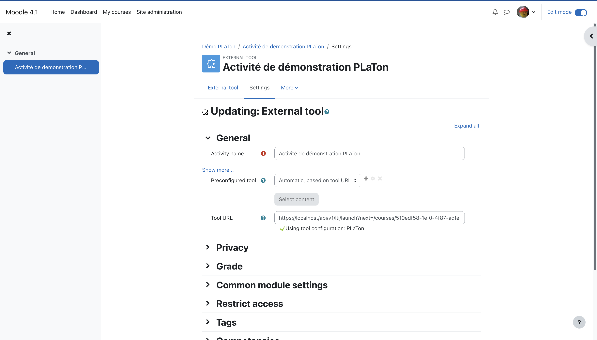

import { Callout } from 'nextra/components'

# Intégration LTI

## Explication du Fonctionnement de LTI (Learning Tools Interoperability)

Learning Tools Interoperability (LTI) est une norme développée par [l'IMS Global Learning Consortium.](https://www.imsglobal.org)
Elle permet l'intégration transparente de divers outils d'apprentissage et de contenus dans des systèmes de gestion de l'apprentissage (LMS).
LTI facilite la communication entre les plateformes d'apprentissage et les outils externes, permettant aux utilisateurs de bénéficier d'une expérience d'apprentissage unifiée sans avoir à se connecter séparément à chaque outil.

## PLaTon en tant qu'Outil LTI

PLaTon est conçu comme un outil LTI, ce qui signifie qu'il peut s'intégrer facilement dans n'importe quel LMS compatible LTI, comme Moodle, Canvas ou Blackboard.
Cette intégration permet aux enseignants et aux étudiants d'accéder à PLaTon directement à partir de leur LMS habituel, en utilisant leurs identifiants existants.

## Ajouter un LMS à PLaTon

Pour intégrer un LMS avec PLaTon, vous devez fournir les informations suivantes dans l'espace d'administration des LMS :

- **Nom** : Nommez votre intégration LMS pour la distinguer facilement dans PLaTon.
- **URL** : L'adresse URL du LMS avec lequel vous souhaitez intégrer PLaTon.
- **URL de résultat** : Cette URL est utilisée par PLaTon pour renvoyer les informations au LMS, telles que les scores ou les progrès des étudiants.
- **Clé** : Une clé unique fournie par le LMS pour authentifier l'intégration.
- **Secret** : Un secret partagé entre PLaTon et le LMS, utilisé en conjonction avec la clé pour sécuriser la communication.

Ces informations permettent une communication sécurisée entre PLaTon et le LMS, garantissant que les données des utilisateurs sont protégées et que l'interaction entre les deux systèmes est fluide.

## Se Connecter à PLaTon depuis un LMS : Exemple avec Moodle

Pour vous connecter à PLaTon depuis Moodle :

### Configuration dans Moodle :

- Allez dans la section de gestion des plugins ou modules complémentaires de Moodle.
- Ajoutez un nouvel outil externe en spécifiant l'URL de PLaTon (https://platon.example.com/api/v1/lti/launch), la clé et le secret fournis.
- Pour plus de détails sur la configuration de l'outil externe dans Moodle, consultez [la documentation Moodle](https://docs.moodle.org/403/en/LTI_External_tools) :

### Utilisation par les Enseignants et les Étudiants :

- Une fois configuré par un adminstrateur Moodle, les enseignants peuvent ajouter l'outil externe à leurs cours Moodle en suivant les instructions [ici](https://docs.moodle.org/403/en/External_tool_settings).
- Définissez `Preconfigured tool` sur `Automatic, based on launch URL` et entrez `https://platon.example.com/api/v1/lti/launch?next=PAGE_URL` dans le champ Tool URL (en remplaçant `PAGE_URL` par l'URL de la page de destination dans PLaTon).
- Lorsque les enseignants et les étudiants cliquent sur le lien de l'outil externe dans leur cours Moodle, ils sont automatiquement redirigés et connectés à PLaTon, les emmenant directement à la page spécifiée après next=.
- Si la page cible est un cours, ils seront inscrits automatiquement dans le cours sur PLaTon.

<Callout type="info">
  Les cours dans PLaTon intègrent un bouton partage qui permet aux enseignants de générer un lien direct vers la page de
  destination dans PLaTon. Ce lien peut être utilisé pour configurer l'outil externe dans Moodle. 
</Callout>
